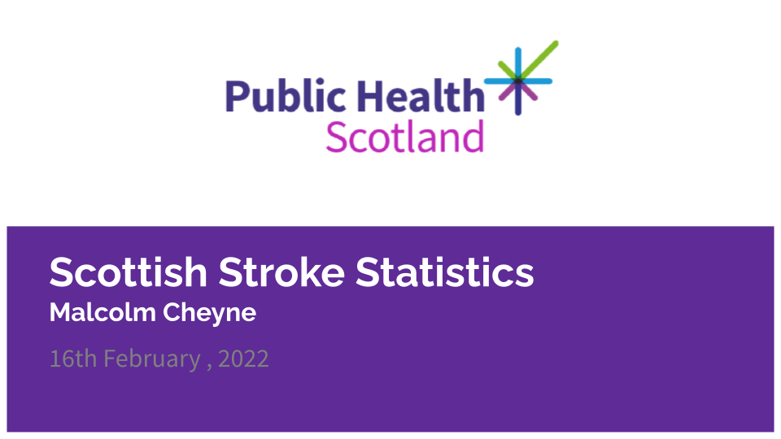

# Final Project

# Scottish Stroke Statistics

Gave a presentation and report using PHS data for Strokes in Scotland between 2009/10 and 2018/19 financial years. Below is a copy of the presentation, the report is in the Scottish Stroke Statistics folder.

.png)

.png)

.png)

.png)

.png)

.png)

.png)

.png)

.png)

.png)

.png)

.png)

.png)

.png)

.png)
